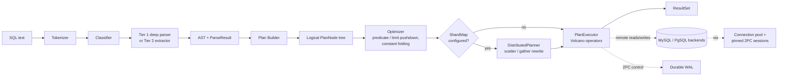
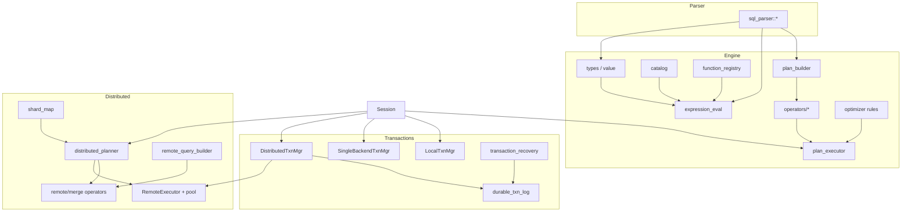
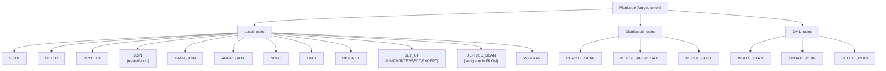
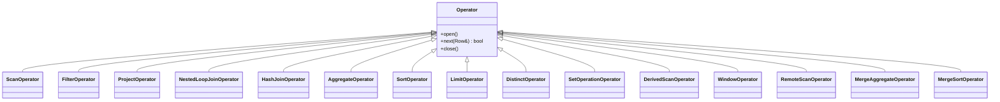
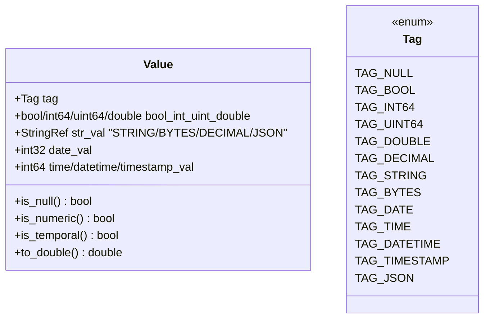
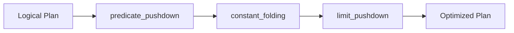
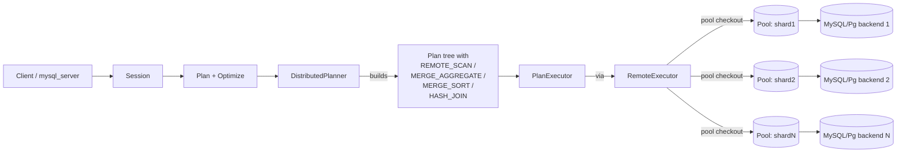
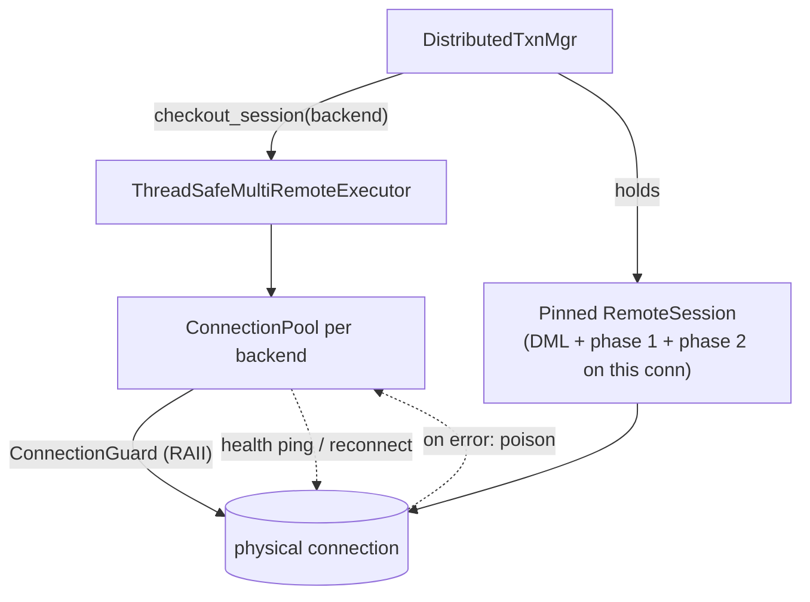
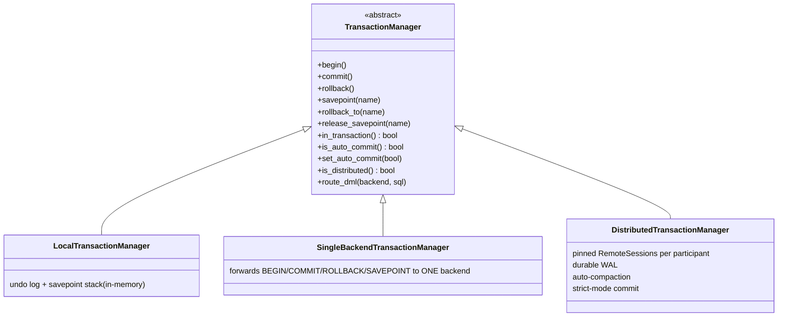
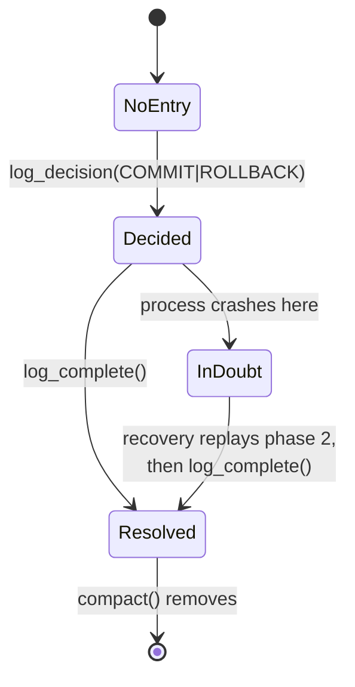

# Architecture and Implementation Status

**Generated:** 2026-04-17
**Scope:** Complete picture of what is implemented, partially implemented, planned, and explicitly out of scope across all four subsystems.
**Audience:** Maintainers, contributors, and reviewers who need a single document to understand "where the project is" without stitching together `README.md`, `CLAUDE.md`, the `docs/superpowers/` history, and the live code.

---

## 1. Executive Summary

This repository is a **production-targeted SQL parsing and distributed query engine** for ProxySQL. It is no longer a parser prototype — it is a four-layer system with 1,160 passing unit tests, 86K+ corpus queries validated, real MySQL/PostgreSQL backend integration, and full two-phase commit (2PC) with a durable write-ahead log.

### State at a glance

| Subsystem                | Maturity            | Tests | Notes                                                                                  |
| ------------------------ | ------------------- | ----- | -------------------------------------------------------------------------------------- |
| **Parser**               | Production-ready    | ~21   | Both MySQL and PostgreSQL; sub-microsecond hot path; query digest + emitter complete.  |
| **Query engine**         | Functional, growing | ~30   | 15 operators, 13 value tags, ~50 builtins, 3 optimizer rules. Volcano model.           |
| **Distributed layer**    | Functional          | ~3    | Sharding, scatter/gather, merge-aggregate, merge-sort, distributed DML, SSL, pooling.  |
| **Transaction layer**    | Functional          | ~3    | 2PC for MySQL (XA) and PostgreSQL (PREPARE TRANSACTION); durable WAL + auto-compaction; recovery. |
| **Tools / wire server**  | Functional          | n/a   | `sqlengine` (see [docs/sqlengine.md](sqlengine.md)), `mysql_server`, `bench_distributed`, `engine_stress_test`, `corpus_test`. |

### What landed recently (committed on `main`, 2026-04-17 to 2026-04-18)

- **Issue 01 (P0) — 2PC safe pinning** — fail-closed unless the executor declares unpinned 2PC safe (`ebefb9f`).
- **Issue 02 (P1) — 2PC deterministic phase timeouts** — PostgreSQL `SET statement_timeout` per phase; MySQL no longer claims to bound XA control statements (`ebefb9f`, bundled with 01).
- **Issue 03 (P1) — shared backend + shard config parsing** — extracted from four tools + one test helper into `tool_config_parser.{h,cpp}` (`f0f2915`, bundled with 09).
- **Issue 04 (P1) — RIGHT and FULL outer joins** — promoted from "rejected at runtime" to "executed correctly", with qualified column resolution (`07d09cb`).
- **Issue 05 (P2) — partial** — compound runtime values (`a90d147`), `CHAR_LENGTH` UTF-8 + PostgreSQL string casts (`9f090e5`).
- **Issue 08 (P1) — single-shard aggregate schema + use-after-free** — `REMOTE_SCAN.output_exprs` + `ResultSet.backing_lifetimes` (`ab8b7fb`).
- **Issue 09 (P0) — shard-key route misdirection** — FNV-1a hash + `RoutingStrategy` enum: HASH/RANGE/LIST (`f0f2915`).
- **Test infra** — `scripts/test_sqlengine.sh` functional suite + 4 Makefile targets (`2ee4128`); 14 ShardMap unit tests + 11 parser-strategy tests.

### What is next (open issues)

- **Issue 05 (P2) — remaining** — non-literal array semantics through the planner, decimal as int128, broader string-backed decimal semantics beyond the cast path.
- **Issue 06 (P2)** — `SELECT ... INTO` placement, recursive CTE semantics.
- **Issue 07 (P2)** — non-recursive CTEs through `Session::execute_query`, not just the test executor.
- **Future sharding strategy** — `PROXYSQL_RULES` value of `RoutingStrategy` to delegate to ProxySQL's `mysql_query_rules` when this engine is embedded inside ProxySQL.

---

## 2. System Architecture

The project is one process with four cooperating subsystems. The main pipeline is:



### Subsystem dependency



### Repository layout

```
include/sql_parser/        Parser headers (tokenizer, parsers, emitter, digest, cache)
src/sql_parser/            Parser .cpp (mainly parser.cpp dispatch + arena impl)
include/sql_engine/        Engine + distributed + transaction headers
include/sql_engine/operators/   15 Volcano operators
include/sql_engine/functions/   5 builtin function categories
include/sql_engine/rules/       3 optimizer rules
src/sql_engine/            Engine implementation (function_registry, multi_remote_executor, ...)
tests/                     51 GoogleTest files
tools/                     CLI / wire server / stress / bench binaries
bench/                     GoogleBenchmark suites
docs/                      Public docs (this file lives here)
docs/superpowers/specs/    Historical design specs
docs/superpowers/plans/    Historical implementation plans
docs/issues/               Local P0/P1/P2 backlog
```

---

## 3. Status Matrix

Legend: ✅ done · 🟡 partial · 📋 planned · ❌ explicitly out of scope.

### 3.1 Parser

| Feature                                                        | Status | Where                                                                        |
| -------------------------------------------------------------- | ------ | ---------------------------------------------------------------------------- |
| Tokenizer (MySQL + PostgreSQL keyword tables)                  | ✅     | `tokenizer.h`, `keywords_mysql.h`, `keywords_pgsql.h`                        |
| Arena allocator (64KB blocks, 1MB max, O(1) reset)             | ✅     | `arena.h` / `arena.cpp`                                                      |
| Classifier + dispatch                                          | ✅     | `parser.cpp::classify_and_dispatch`                                          |
| Tier 1 deep parsers — SELECT, INSERT, UPDATE, DELETE, SET, CTE, compound queries | ✅     | `select_parser.h`, `insert_parser.h`, `update_parser.h`, `delete_parser.h`, `set_parser.h`, `compound_query_parser.h`, `with_parser.h` |
| Tier 2 extractors — DDL, ACL, LOCK, SHOW, USE, PREPARE/EXECUTE/DEALLOCATE, transaction control, RESET | ✅     | `parser.h` / `parser.cpp`                                                    |
| Pratt expression parser (binary/unary, BETWEEN, IN, CASE, ARRAY, tuples, ROW(), field access, subqueries, window functions, EXISTS, IS NULL) | ✅     | `expression_parser.h`                                                        |
| Star modifiers `* EXCEPT/REPLACE`                              | ✅     | merged via #20                                                               |
| Emitter — NORMAL mode (faithful round-trip)                    | ✅     | `emitter.h`                                                                  |
| Emitter — DIGEST mode (literals→`?`, IN collapsing, uppercasing) | ✅     | `emitter.h`                                                                  |
| Emitter — bindings (materialize `?` from a parameter map)      | ✅     | `emitter.h`                                                                  |
| Statement cache (LRU, default cap 128)                         | ✅     | `stmt_cache.h`                                                               |
| Corpus harness (`corpus_test`, 86K+ queries, 99.92% parsed)    | ✅     | `tests/corpus_test.cpp`                                                      |
| MySQL `SELECT ... INTO` placement variants                     | 📋     | issue 06                                                                     |
| Recursive CTE semantics (parse + plan integration)             | 📋     | issue 06 + issue 07                                                          |
| Cross-dialect emission (parse MySQL → emit PostgreSQL)         | ❌     | spec non-goal                                                                |
| Views, complex constraint parsing                              | ❌     | spec non-goal                                                                |

### 3.2 Query Engine — Type System & Evaluation

| Feature                                                        | Status | Where                                                                        |
| -------------------------------------------------------------- | ------ | ---------------------------------------------------------------------------- |
| `Value` (13 active tags: NULL, BOOL, INT64, UINT64, DOUBLE, DECIMAL, STRING, BYTES, DATE, TIME, DATETIME, TIMESTAMP, JSON) | ✅     | `value.h`                                                                    |
| `SqlType` (~30 kinds incl. ENUM, ARRAY, JSON/JSONB, all numeric/string/temporal) | ✅     | `types.h`                                                                    |
| `CoercionRules<D>` — dialect-aware promotion                   | ✅     | `coercion.h`                                                                 |
| Three-valued NULL logic for AND/OR/comparisons                 | ✅     | `null_semantics.h`                                                           |
| Expression evaluator (literals, columns, ops, BETWEEN, IN, LIKE, CASE, function calls, subqueries via callback) | ✅     | `expression_eval.h`                                                          |
| Catalog interface + `InMemoryCatalog`                          | ✅     | `catalog.h`, `in_memory_catalog.h`                                           |
| Function registry (54 registrations across arithmetic/comparison/string/datetime/cast) | ✅     | `function_registry.cpp`                                                      |
| Tuple values (`TAG_TUPLE`) + named field access                | 📋     | spec `2026-04-16-compound-value-support-design.md`                           |
| Array values (`TAG_ARRAY`) + non-literal arrays + subscript    | 📋     | spec `2026-04-16-compound-value-support-design.md`                           |
| `INTERVAL` runtime tag                                         | 📋     | removed for now; will return with a real producer (`value.h:30-36`)          |
| Decimal as int128                                              | 📋     | spec deferral                                                                |
| Aggregate functions (COUNT/SUM/AVG/MIN/MAX) — implemented as operator state, not registry entries | ✅     | `aggregate_op.h`                                                             |
| JSON functions                                                 | ❌     | spec non-goal (P3, not yet scheduled)                                        |
| `CHAR_LENGTH` counts UTF-8 code points (not bytes)             | ✅     | `functions/string.h` (issue 05 partial)                                      |
| PostgreSQL casts handle bool / date / time strings             | ✅     | `functions/cast.h` (issue 05 partial)                                        |
| Tuple values (`TAG_TUPLE`) + named field access                | ✅     | `value.h`, `expression_eval.h` (issue 05 partial)                            |
| Array values (`TAG_ARRAY`) + non-literal arrays + subscript    | ✅     | `value.h`, `expression_eval.h` (issue 05 partial)                            |

### 3.3 Query Engine — Plan & Execution

| Feature                                                        | Status | Where                                                                        |
| -------------------------------------------------------------- | ------ | ---------------------------------------------------------------------------- |
| `PlanNodeType` (17 values: SCAN, FILTER, PROJECT, JOIN, AGGREGATE, SORT, LIMIT, DISTINCT, SET_OP, DERIVED_SCAN, REMOTE_SCAN, MERGE_AGGREGATE, MERGE_SORT, WINDOW, INSERT_PLAN, UPDATE_PLAN, DELETE_PLAN) | ✅     | `plan_node.h`                                                                |
| Plan builder (SELECT → plan tree)                              | ✅     | `plan_builder.h`                                                             |
| DML plan builder (INSERT / UPDATE / DELETE)                    | ✅     | `dml_plan_builder.h`                                                         |
| Volcano executor — open / next / close                         | ✅     | `plan_executor.h`                                                            |
| Operators (15): scan, filter, project, join, hash_join, aggregate, sort, limit, distinct, set_op, derived_scan, window, remote_scan, merge_aggregate, merge_sort | ✅     | `operators/`                                                                 |
| `NestedLoopJoinOperator` — INNER, LEFT, CROSS                  | ✅     | `join_op.h`                                                                  |
| `NestedLoopJoinOperator` — RIGHT and FULL outer joins          | ✅     | `join_op.h` (right-match tracking + qualified name resolution; issue 04)     |
| Optimizer — predicate pushdown                                 | ✅     | `rules/predicate_pushdown.h`                                                 |
| Optimizer — limit pushdown                                     | ✅     | `rules/limit_pushdown.h`                                                     |
| Optimizer — constant folding                                   | ✅     | `rules/constant_folding.h`                                                   |
| Optimizer — projection pruning                                 | 📋     | spec mentions (`2026-04-04-optimizer-design.md`); not yet a rule file        |
| Subquery executor (scalar / EXISTS / IN / correlated / derived) | ✅     | `subquery_executor.h`, `derived_scan_op.h`                                  |
| Plan cache (LRU bounded, on `Session<D>`)                      | ✅     | `session.h`                                                                  |
| Cost-based optimization, join reordering, index selection      | ❌     | spec non-goals                                                               |
| Streaming / cursor output (instead of materialized ResultSet)  | ❌     | spec non-goal                                                                |
| Vectorized execution                                           | ❌     | spec non-goal                                                                |

### 3.4 Distributed Layer

| Feature                                                        | Status | Where                                                                        |
| -------------------------------------------------------------- | ------ | ---------------------------------------------------------------------------- |
| `ShardMap` — unsharded tables + three routing strategies (HASH / RANGE / LIST) for sharded tables | ✅     | `shard_map.h` (FNV-1a hash; RANGE int-keyed; LIST int + string)              |
| `RemoteExecutor` abstract interface                            | ✅     | `remote_executor.h`                                                          |
| `MySQLRemoteExecutor` (single connection per backend)          | ✅     | `mysql_remote_executor.h`                                                    |
| `PgSQLRemoteExecutor` (single connection per backend)          | ✅     | `pgsql_remote_executor.h`                                                    |
| `MultiRemoteExecutor` (multi-dialect wrapper)                  | ✅     | `multi_remote_executor.h`                                                    |
| `ThreadSafeMultiRemoteExecutor` (production: pool, pinned 2PC) | ✅     | `multi_remote_executor.h`                                                    |
| `ConnectionPool` with health pings + RAII checkout + poisoning | ✅     | `connection_pool.h`                                                          |
| SSL/TLS for both backends (`ssl_mode/ca/cert/key`)             | ✅     | per executor                                                                 |
| `DistributedPlanner::distribute_node` — scatter SCAN, predicate pushdown, two-phase aggregation, distributed sort/set-op, cross-shard join materialization | ✅     | `distributed_planner.h`                                                      |
| `DistributedPlanner::distribute_dml` — sharded INSERT/UPDATE/DELETE | ✅     | `distributed_planner.h`                                                      |
| `RemoteQueryBuilder` — emit SELECT / INSERT / UPDATE / DELETE  | ✅     | `remote_query_builder.h`                                                     |
| `RemoteScanOperator`, `MergeAggregateOperator`, `MergeSortOperator`, `HashJoinOperator` | ✅ | `operators/`                                                                 |
| TIMESTAMPTZ normalised to UTC in PgSQL executor                | ✅     | recent commit `1f65334`                                                      |
| `PgSQLRemoteExecutor` returns `parse_datetime_tz` UTC-normalised values | ✅ | recent commit `293b19b`                                                      |
| Shared backend-URL + shard-spec parsing                        | ✅     | `tool_config_parser.{h,cpp}` (issue 03)                                      |
| Wire-protocol *server* for the engine                          | ✅     | `tools/mysql_server.cpp` (this is the proxy front-end)                       |
| Async / parallel shard I/O beyond pool concurrency             | 📋     | spec defers                                                                  |
| `RETURNING` clause through remote DML                          | 📋     | parser non-goal until INSERT/UPDATE/DELETE Tier 1 promotion completes        |

### 3.5 Transaction Layer

| Feature                                                        | Status | Where                                                                        |
| -------------------------------------------------------------- | ------ | ---------------------------------------------------------------------------- |
| `LocalTransactionManager` — in-memory undo log, savepoints     | ✅     | `local_txn.h`                                                                |
| `SingleBackendTransactionManager` — forwards BEGIN/COMMIT/ROLLBACK/SAVEPOINT to one backend | ✅ | `single_backend_txn.h`                                                       |
| `DistributedTransactionManager` — 2PC coordinator              | ✅     | `distributed_txn.h`                                                          |
| MySQL XA flow (`XA START` → `XA END` → `XA PREPARE` → `XA COMMIT`/`XA ROLLBACK`) | ✅ | `distributed_txn.h`                                                          |
| PostgreSQL flow (`BEGIN` → `PREPARE TRANSACTION` → `COMMIT PREPARED`/`ROLLBACK PREPARED`) | ✅ | `distributed_txn.h`                                                          |
| Pinned `RemoteSession` per participant for full txn lifetime   | ✅     | `remote_session.h`, `distributed_txn.h`                                      |
| Durable WAL (text, fsync per record)                           | ✅     | `durable_txn_log.h`                                                          |
| WAL auto-compaction on completion threshold                    | ✅     | commit `a2d9525`                                                             |
| Crash recovery — drives in-doubt txns; idempotent (`XAER_NOTA`, `does not exist`) | ✅ | `transaction_recovery.h`                                                     |
| `Session::execute_statement` auto-enlistment of remote DML through pinned 2PC connection | ✅ | `session.h`                                                                  |
| **Fail-closed** unpinned 2PC: executor must opt in via `allows_unpinned_distributed_2pc()` | ✅ | `remote_executor.h`, `distributed_txn.h` (issue 01)                          |
| **Deterministic** per-phase timeouts: PostgreSQL uses `SET statement_timeout`; MySQL no longer pretends to bound XA controls | ✅ | `distributed_txn.h` (issue 02) |
| Distributed savepoints                                         | 📋     | spec defers; only single-backend path supports them today                    |
| MVCC isolation                                                 | ❌     | spec non-goal (storage lives in MySQL/PostgreSQL)                            |

---

## 4. Parser — Drill-down

### 4.1 Pipeline

```mermaid
flowchart LR
    Buf["Input buffer (StringRef)"] --> Tk[Tokenizer<D>]
    Tk -- "Token{type, StringRef, off}" --> Cl[classify_and_dispatch]
    Cl -- T1 --> SP[SelectParser / SetParser /<br/>InsertParser / UpdateParser /<br/>DeleteParser / CompoundQueryParser]
    Cl -- T2 --> EX[extract_ddl / extract_acl /<br/>extract_show / extract_use / ...]
    SP --> Out[ParseResult{status, ast, type, table, remaining}]
    EX --> Out
    Out --> EM[Emitter<D><br/>NORMAL / DIGEST / bindings]
    Out --> CACHE[StmtCache<br/>(LRU, per thread)]
```

### 4.2 Two-tier design rationale

- **Tier 1** queries are on the hot path of OLTP traffic; we need full AST so we can rewrite, route, and execute. SELECT/INSERT/UPDATE/DELETE and SET fall here.
- **Tier 2** queries are control / DDL / admin: we only need *enough* AST to classify, capture the table identifier, and re-emit. This keeps the parser fast on a wide tail of statement shapes.

### 4.3 Notable parser features

- Both dialects share the same template machinery (`Parser<Dialect::MySQL>` / `Parser<Dialect::PostgreSQL>`); keyword tables and a few branches diverge.
- The Pratt expression parser is shared by every Tier 1 statement.
- Round-trip emission is **faithful** (whitespace-normalised but semantically identical), making the engine usable as a query rewriter.
- The DIGEST emission produces a 64-bit hash suitable for prepared-statement and traffic-pattern grouping.

### 4.4 Parser gaps and planned work

- `SELECT ... INTO` placement variants (MySQL): the parser currently skips some forms — issue 06.
- Recursive CTE semantics (`WITH RECURSIVE`): parsed but not fully connected to the planner — issue 06.
- Non-recursive CTE integration into the main `Session::execute_query` path — issue 07.

---

## 5. Query Engine — Drill-down

### 5.1 Plan node taxonomy



### 5.2 Operator inventory (Volcano model)



### 5.3 Value model

13 active tags; intentionally tight to make `Value` cheap to copy.



> Removed: `TAG_INTERVAL` (no producer end-to-end). Will be re-added together with a real producer (PostgreSQL `INTERVAL` OID parsing or a `DATE_ADD(date, INTERVAL N unit)` parser path). Source: `value.h:30-36`.
>
> Planned: `TAG_ARRAY`, `TAG_TUPLE` per `docs/superpowers/specs/2026-04-16-compound-value-support-design.md` (local-runtime only; remote serialization explicitly out of scope).

### 5.4 Function registry

`src/sql_engine/function_registry.cpp` holds 54 `register_function` entries grouped into five files under `include/sql_engine/functions/`:

| Category    | File             | Examples                                                    |
| ----------- | ---------------- | ----------------------------------------------------------- |
| arithmetic  | `arithmetic.h`   | ABS, CEIL/CEILING, FLOOR, ROUND, MOD, POWER, SQRT, SIGN     |
| comparison  | `comparison.h`   | COALESCE, NULLIF, GREATEST, LEAST                           |
| string      | `string.h`       | CONCAT, CONCAT_WS, UPPER, LOWER, SUBSTR, TRIM, REPLACE, LPAD, RPAD, LEFT, RIGHT, LENGTH, CHAR_LENGTH (UTF-8 aware in working tree) |
| datetime    | `datetime.h`     | NOW, CURRENT_DATE/TIME, YEAR/MONTH/DAY/HOUR/MINUTE/SECOND, UNIX_TIMESTAMP, FROM_UNIXTIME, DATEDIFF, `parse_datetime_tz` |
| cast        | `cast.h`         | CAST(x AS T), CONVERT (working-tree: PostgreSQL bool/date/time string casts) |

> Aggregates (`COUNT`, `SUM`, `AVG`, `MIN`, `MAX`) are implemented inside `AggregateOperator`, not as registry entries.

### 5.5 Optimizer rules



The order is fixed and single-pass; the architecture leaves room for cost-based rules but spec explicitly defers them.

---

## 6. Distributed Layer — Drill-down

### 6.1 Topology



### 6.2 Routing strategies

`TableShardConfig::strategy` selects how a value of the shard key maps to a shard index.

| Strategy | Resolution                                                                       | Key types | Out-of-range / miss              |
| -------- | -------------------------------------------------------------------------------- | --------- | -------------------------------- |
| `HASH`   | FNV-1a 64-bit of the key bytes, modulo `num_shards`                              | int + str | n/a (always defined)             |
| `RANGE`  | Sorted `(upper_inclusive, shard_index)` entries; first match wins                | int only  | last entry's shard (MAXVALUE)    |
| `LIST`   | Explicit `value -> shard_index` map                                              | int + str | shard 0                          |

The `--shard` flag accepts the strategy as an optional qualifier (back-compat: `table:key:s1,s2` defaults to `HASH`). The `RoutingStrategy` enum is the seam where a future `PROXYSQL_RULES` strategy will plug in to delegate to ProxySQL's `mysql_query_rules`.

### 6.3 Distribution patterns

| SQL shape                                      | Rewrite                                                                 |
| ---------------------------------------------- | ----------------------------------------------------------------------- |
| `SELECT … FROM unsharded`                      | Single REMOTE_SCAN to the pinned backend.                               |
| `SELECT … FROM sharded WHERE shard_key = K`    | Routed REMOTE_SCAN to the one shard chosen by the configured strategy.  |
| `SELECT … FROM sharded` (no key predicate)     | Scatter REMOTE_SCAN to every shard, gather locally.                     |
| `SELECT col, AGG(x) … GROUP BY col`            | Two-phase: per-shard partial aggregate + local MERGE_AGGREGATE.         |
| `SELECT … ORDER BY k LIMIT n`                  | Per-shard ORDER BY + LIMIT n; local MERGE_SORT + LIMIT.                 |
| `SELECT … FROM sharded JOIN sharded ON …`      | Materialize one side, hash-join locally (HASH_JOIN + REMOTE_SCAN inputs). |
| `INSERT/UPDATE/DELETE on sharded`              | Distributed DML: one REMOTE_SCAN per affected shard, in DML mode.       |

### 6.4 Connection pool + pinning



Pinning matters: phase 1 and phase 2 *must* land on the same physical connection. The working-tree change to `distributed_txn.h` makes that requirement enforced rather than best-effort (issue 01).

---

## 7. Transaction Layer — Drill-down

### 7.1 Manager class hierarchy



### 7.2 2PC sequence (working-tree behaviour)

```mermaid
sequenceDiagram
    participant App
    participant DT as DistributedTxnMgr
    participant WAL as Durable WAL
    participant P1 as Participant 1<br/>(MySQL)
    participant P2 as Participant 2<br/>(PostgreSQL)

    App->>DT: begin()
    App->>DT: route_dml(P1, "INSERT ...")
    DT->>P1: XA START 'txn'; INSERT ...; XA END 'txn'
    App->>DT: route_dml(P2, "UPDATE ...")
    DT->>P2: BEGIN; UPDATE ...
    App->>DT: commit()
    Note over DT: PHASE 1 — PREPARE
    DT->>P1: XA PREPARE 'txn'
    DT->>P2: SET statement_timeout = X; PREPARE TRANSACTION 'txn'
    alt all prepared
      DT->>WAL: COMMIT\\ttxn\\tP1,P2 (fsync)
      Note over DT: PHASE 2 — COMMIT
      DT->>P1: XA COMMIT 'txn'
      DT->>P2: SET statement_timeout = X; COMMIT PREPARED 'txn'
      DT->>WAL: COMPLETE\\ttxn (fsync)
    else any failure in phase 1
      DT->>WAL: ROLLBACK\\ttxn\\tP1,P2 (fsync)
      DT->>P1: XA ROLLBACK 'txn'
      DT->>P2: ROLLBACK PREPARED 'txn'
      DT->>WAL: COMPLETE\\ttxn (fsync)
    end
```

Notes (working-tree behaviour, issues 01 + 02):

- `route_dml` and both phases run on the **same pinned RemoteSession** per participant.
- If the executor cannot guarantee pinning, `enlist_backend` fails closed unless the executor sets `allows_unpinned_distributed_2pc() == true`.
- PostgreSQL gets a real per-phase `SET statement_timeout`. MySQL no longer claims to bound XA control statements (XA rejects `max_execution_time`); reliance falls on connection-level read/write timeouts.

### 7.3 Durable WAL

Format (line-based, tab-separated, fsync per record):

```
COMMIT   <txn_id>   <participant1>,<participant2>,...
ROLLBACK <txn_id>   <participant1>,<participant2>,...
COMPLETE <txn_id>
```

State machine for any txn id:



- **Auto-compaction:** `set_auto_compact_threshold(N)` triggers `compact()` after every `N` successful completions.
- **Recovery:** `TransactionRecovery::recover()` is idempotent — `XAER_NOTA` (MySQL) and "does not exist"/"not found" (PostgreSQL) are treated as already resolved.

### 7.4 Session auto-enlistment

`Session::execute_statement` checks `txn_mgr.in_transaction() && txn_mgr.is_distributed()`. If both are true and the target table is remote, the DML is routed through `txn_mgr.route_dml(backend, sql)` so it lands on the pinned 2PC connection — never a fresh pool checkout.

---

## 8. Local Issue Backlog

Source: `docs/issues/README.md`. Status reflects the working tree on 2026-04-17.

### P0 — correctness / production risk

1. **[01] Distributed 2PC must require safe session pinning** — ✅ resolved 2026-04-18 (commit ebefb9f).
   *`allows_unpinned_distributed_2pc()` flag added; defaults to false; pooled executors without pinning cannot enlist; opt-in for single-connection executors.*
9. **[09] Single-shard route by shard key misdirects for some keys** — ✅ resolved 2026-04-18 (commit f0f2915).
   *Root cause: `std::hash<int64_t>` on libstdc++ is identity, so route `= K mod num_shards`; demo data placement was range-based. Fix: FNV-1a 64-bit hash + `RoutingStrategy` enum on `TableShardConfig` (HASH default, RANGE, LIST). The new `--shard "table:key:range:5=s1,10=s2"` syntax matches the demo's range placement. Engine is now ProxySQL-shaped — a future `PROXYSQL_RULES` strategy can join the same enum.*

### P1 — important correctness & maintainability

2. **[02] Make 2PC phase timeouts deterministic** — ✅ resolved 2026-04-18 (commit ebefb9f, bundled with issue 01).
   *PostgreSQL: `SET statement_timeout` per phase. MySQL: no per-phase SQL timeout (XA rejects `max_execution_time`); rely on connection read/write timeouts.*
3. **[03] Extract shared backend + shard config parsing** — ✅ resolved 2026-04-18 (commit f0f2915, bundled with issue 09).
   *New module `tool_config_parser.{h,cpp}`. Replaces ~135 lines of duplication in each of `sqlengine`, `mysql_server`, `bench_distributed`, `engine_stress_test`, plus `tests/test_ssl_config.cpp`.*
4. **[04] Close join execution coverage gaps** — ✅ resolved 2026-04-18 (commit 07d09cb).
   *`NestedLoopJoinOperator` now executes RIGHT and FULL outer joins (with right-row match tracking) and resolves qualified column names in join conditions.*
8. **[08] Aggregate projection schema wrong in single-shard mode** — ✅ resolved 2026-04-18 (commit ab8b7fb).
   *Two stacked bugs. (a) `make_unsharded_aggregate` returned a bare `REMOTE_SCAN` whose `build_column_names` defaulted to the source table's columns; fixed by adding `output_exprs` to the remote-scan plan node. (b) After (a), values still rendered as `?` because `RemoteScanOperator`'s heap-owned storage died with the stack-local `PlanExecutor` while the returned rows still pointed into it; fixed by adding `backing_lifetimes` to `ResultSet` so operators outlive the executor's stack frame.*

### P2 — deferred

5. **[05] Tighten expression and type semantics** — 🟡 partial. Arrays/tuples/named-field-access landed (commit a90d147), `CHAR_LENGTH` UTF-8 + PostgreSQL string casts landed (commit 9f090e5).
   *Still open: non-literal array semantics through the planner, decimal as int128, broader string-backed decimal semantics beyond the cast path.*
6. **[06] MySQL `SELECT ... INTO` and recursive CTE handling** — 📋 not started.
7. **[07] Integrate non-recursive CTE handling into `Session` query path** — 📋 not started.

---

## 9. Working-tree state

Clean. All issue work that lived in the working tree has landed on `main` as separately-attributable commits (see §8 for the per-issue commit hashes). Verified end-to-end:

- `make test` — 1208 passed, 37 skipped (live-backend integration), 0 failed.
- `scripts/test_sqlengine.sh all` — 34/34 (in-memory + single backend + sharded).

The only untracked entries left are intentional:

- `.claude/` — local Claude Code session data, not for commit.
- `third_party/libpg_query/` — external dependency downloaded on demand by `scripts/run_benchmarks.sh` for comparison runs; not committed.

---

## 10. Roadmap

The order below reflects the explicit `docs/issues/` priorities and the newest specs/plans, not aspiration.

### Near term — finish what's in flight

1. Land working-tree changes for issues **01–04** as four (or one bundled) commits.
2. Run `make all`, the corpus tests, and the distributed/integration suites against live backends.
3. Continue **issue 05** along the path the new `2026-04-16-compound-value-support` plan opens (tuples + arrays as runtime `Value`s).

### Mid term — feature breadth

4. **Compound values** (spec + plan dated 2026-04-16): `TAG_ARRAY` + `TAG_TUPLE`, runtime subscript, named field access. Local runtime only.
5. **Issue 07** — wire non-recursive CTEs through `Session::execute_query` (planner + executor responsibilities clarified, no special path).
6. **Issue 06** — close the parser gaps (`SELECT ... INTO` placement, recursive CTE semantics).
7. Re-introduce `TAG_INTERVAL` together with a real producer (PostgreSQL `INTERVAL` OID, or `DATE_ADD(d, INTERVAL N unit)`).

### Longer term / explicitly deferred

- **Distributed savepoints.** Today only `SingleBackendTransactionManager` supports them.
- **Cost-based optimization, join reordering, index selection, subquery decorrelation.** Spec calls these out as non-goals for now; the architecture leaves room.
- **Streaming / cursored result sets, vectorized execution.** Spec non-goals.
- **JSON functions.** Spec P3, not yet scheduled.
- **Decimal as int128.** Spec deferral; current `TAG_DECIMAL` stores a `StringRef`.
- **Cross-dialect emission** (parse MySQL → emit PostgreSQL, or vice versa). Explicit non-goal.
- **Wire-protocol *client*, async execution, built-in HA.** Non-goals; ProxySQL is the integration point.

---

## 11. Glossary

- **Tier 1 / Tier 2** — Tier 1 statements get a deep AST and full rewrite; Tier 2 statements get a thin "extracted" AST (mostly identifying the table). The split lets us keep the hot path fast.
- **Volcano model** — Each operator exposes `open / next / close`. The plan tree pulls one row at a time from the root.
- **Pinned session** — A `RemoteSession` that holds a single physical backend connection across DML and both 2PC phases for one participant. Required for XA / `PREPARE TRANSACTION`.
- **In-doubt transaction** — A txn for which the WAL has a `COMMIT` or `ROLLBACK` decision but no `COMPLETE`. Recovery's job is to drive these to completion.
- **Scatter / gather** — Send the same query to every shard, then merge results locally. The default for non-shard-key queries on a sharded table.
- **Two-phase aggregation** — Compute partial aggregates (e.g. `SUM(x)`, `COUNT(*)`) on each shard, then combine them with `MergeAggregateOperator` (`SUM_OF_COUNTS`, `SUM_OF_SUMS`, `MIN_OF_MINS`, `MAX_OF_MAXES`, `AVG_FROM_SUM_COUNT`).

---

## 12. Where to look next

- **`CLAUDE.md`** — file-level architecture guide for maintainers; how to add a parser, operator, function, data source, catalog, or transaction manager.
- **`README.md`** — public overview, quick-start, build/test commands, benchmark numbers.
- **`AGENTS.md`** — contributor workflow + repository conventions.
- **`docs/current-state.md`** — earlier implementation snapshot (Apr 15); this document supersedes it.
- **`docs/issues/`** — current local backlog with per-issue evidence, scope, acceptance criteria, verification.
- **`docs/superpowers/specs/`** — historical design specs for parser, type system, evaluator, optimizer, executor, distributed planner, transactions, subqueries, backend connections, and the newest compound-value design.
- **`docs/superpowers/plans/`** — historical implementation plans matching those specs, plus the two newest (2026-04-15 distributed-2PC-safe-pinning, 2026-04-16 compound-value-support).
- **`docs/benchmarks/`** — benchmark outputs and reproduction notes.
- **`docs/sqlengine.md`** — reference for the interactive `sqlengine` CLI: modes, flags, REPL behaviour, recipes for in-memory / single-backend / sharded / SSL / cross-shard JOIN, and what it deliberately does *not* do today.
